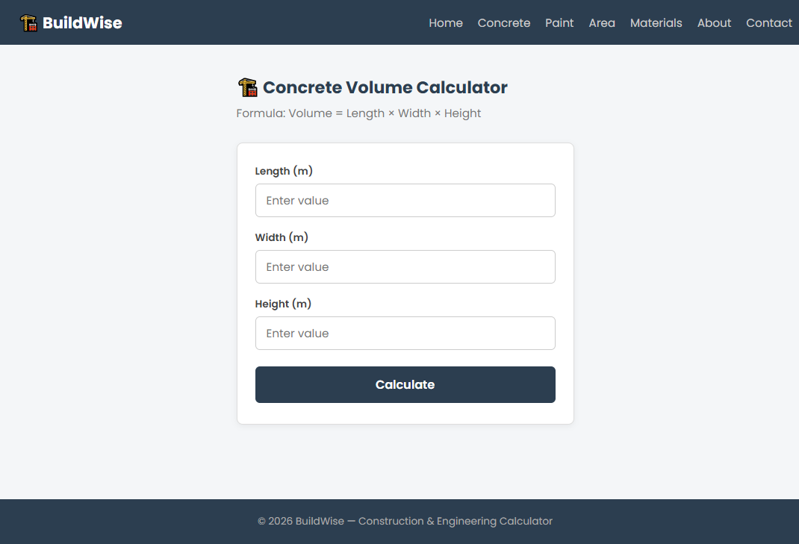
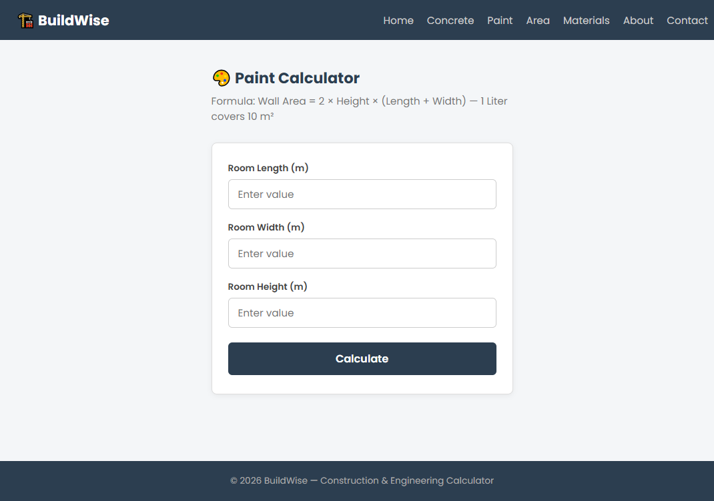
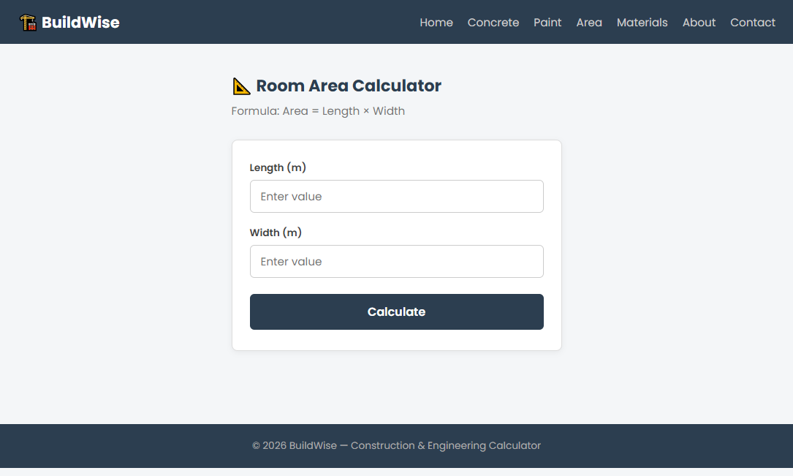
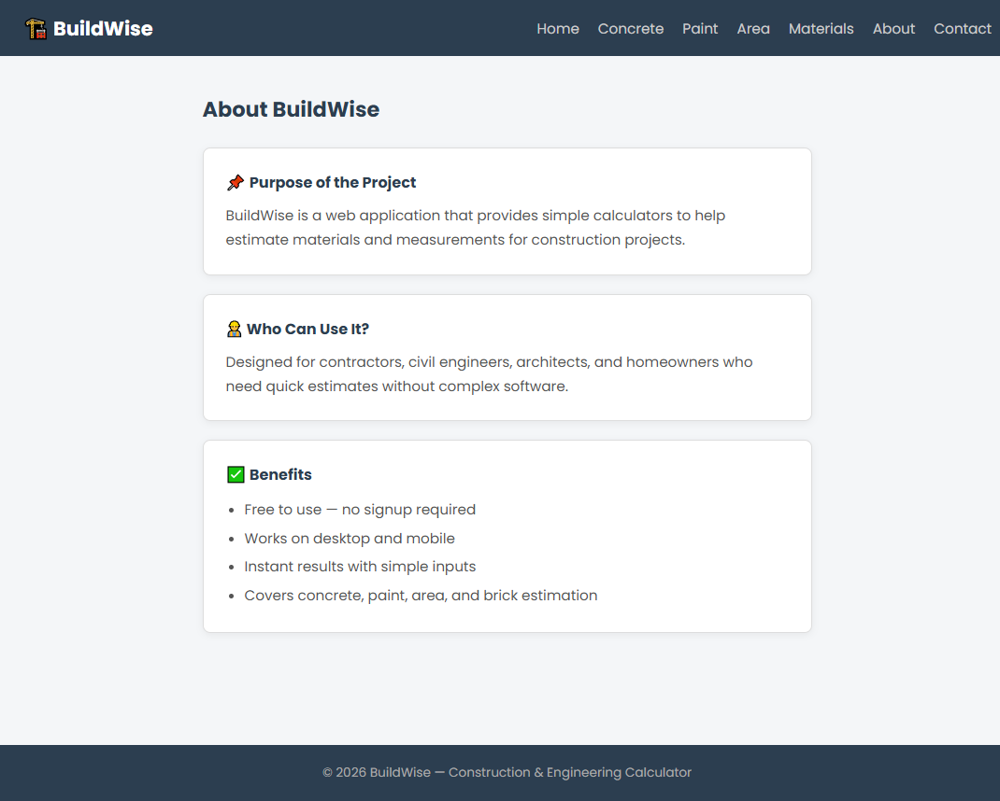
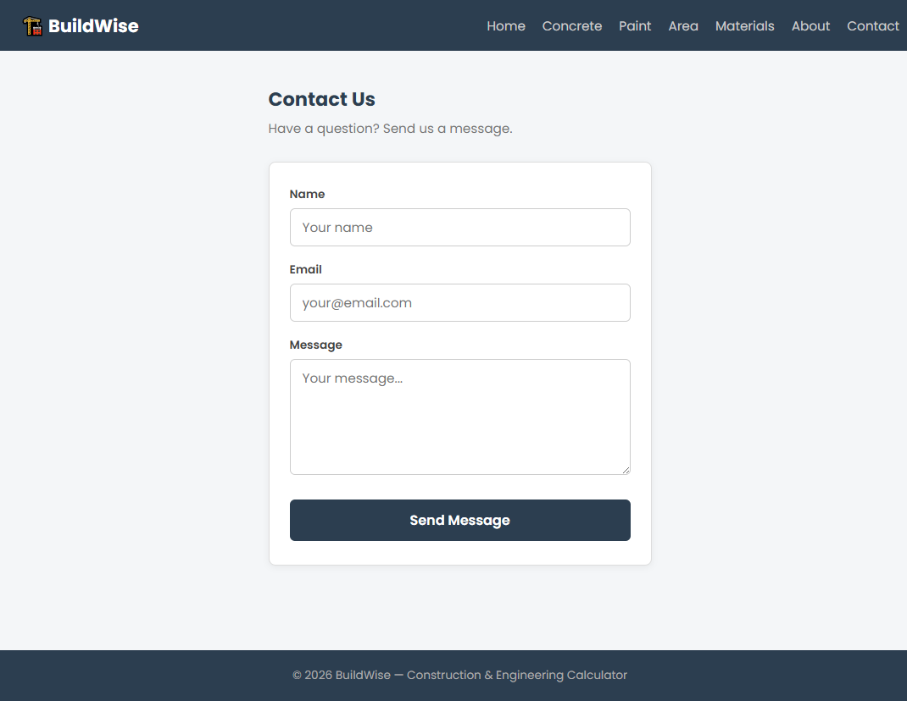
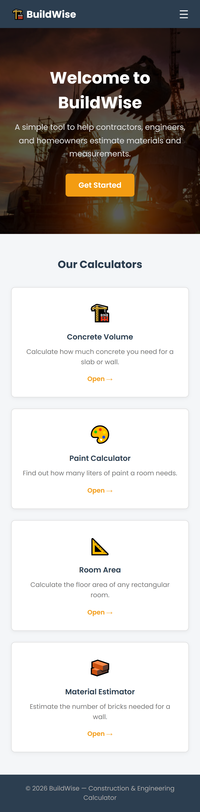
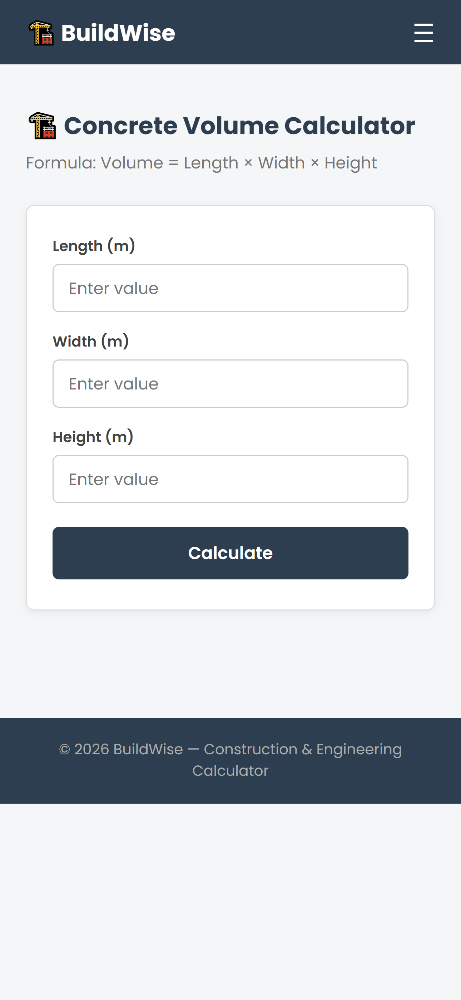

# BuildWise - Construction Calculator App

This is my project for the web development course. I built a React app called BuildWise that helps people calculate things related to construction like how much concrete they need, how many bricks, paint, and the area of a room.

---

## Project Description

The idea came from thinking about something useful. A lot of people who do construction work or even just renovating their house have to do these calculations manually or use complicated software. So I made a simple website with 4 calculators:

- **Concrete Volume Calculator** - you enter the length, width and height and it tells you how many cubic meters of concrete you need
- **Paint Calculator** - calculates how many liters of paint you need based on the room size
- **Room Area Calculator** - simple length x width to get the floor area in m²
- **Material Estimator** - estimates how many bricks you need for a wall (uses 60 bricks per m² as the standard)

There's also an About page that explains the project and a Contact page with a form.

---

## How to Run the Project

First make sure you have Node.js installed on your computer.

Then follow these steps:

```bash

git clone https://github.com/YOUR_USERNAME/buildwise.git

# go into the folder
cd buildwise

# install the packages
npm install

# run it
npm start
```

It should open automatically at `http://localhost:3000` in your browser.

If you want to build it for production:

```bash
npm run build
```

---

## Project Structure

I organized the files like this:

```
buildwise/
├── public/
│   └── index.html
├── src/
│   ├── assets/
│   │   └── hero-bg.jpg
│   ├── components/
│   │   ├── Navbar.js
│   │   └── Footer.js
│   ├── pages/
│   │   ├── Home.js
│   │   ├── Concrete.js
│   │   ├── Paint.js
│   │   ├── Area.js
│   │   ├── Materials.js
│   │   ├── About.js
│   │   └── Contact.js
│   ├── styles/
│   │   ├── Navbar.css
│   │   ├── Footer.css
│   │   ├── Home.css
│   │   ├── Calculator.css
│   │   ├── About.css
│   │   └── Contact.css
│   ├── App.js
│   └── index.css
└── package.json
```

I put each page in its own file and each component has its own CSS file to keep things organized.

---

## Technologies I Used

- **React** - for building the UI with components
- **React Router DOM** - for navigating between pages without reloading
- **CSS3** - I wrote all the styling myself, used flexbox and grid for layout
- **Google Fonts** - used the Poppins font

---

## Screenshots












---

## Features

- Works on mobile and desktop (I added a hamburger menu for small screens)
- No login needed
- Results show up instantly
- Simple and clean design
